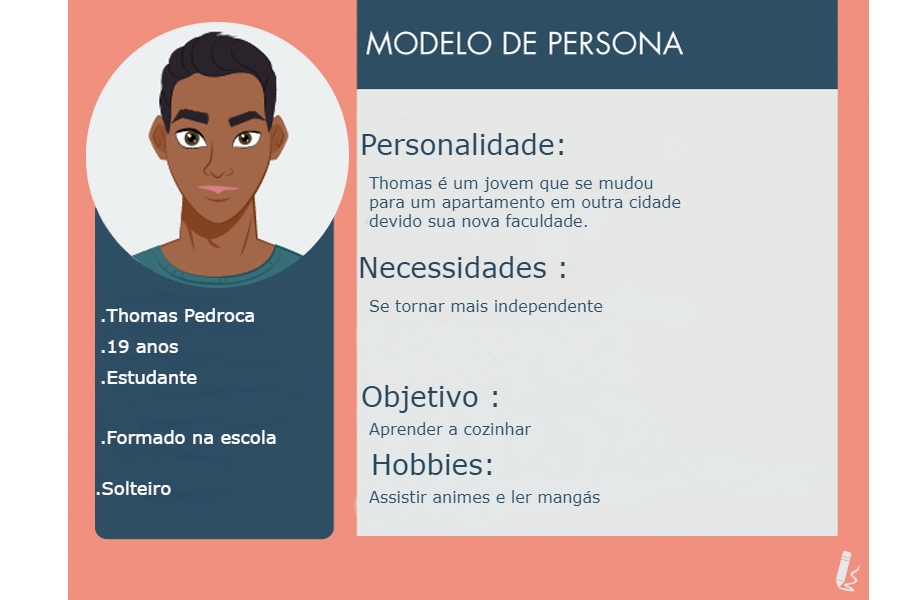
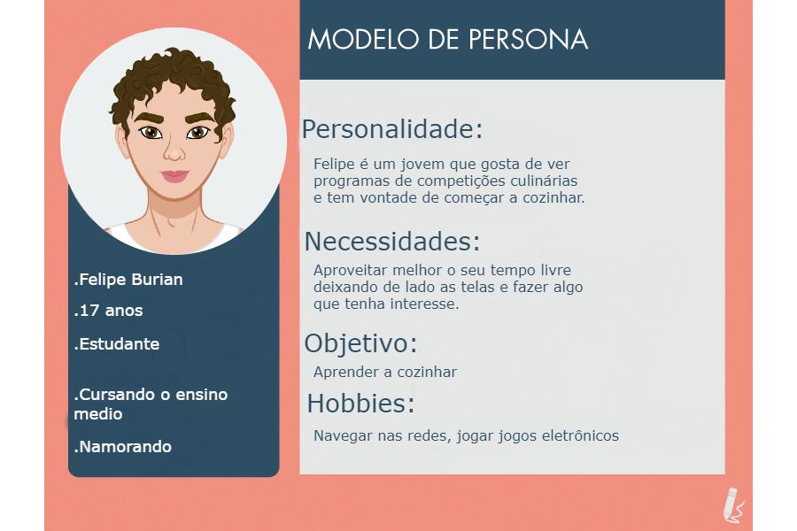
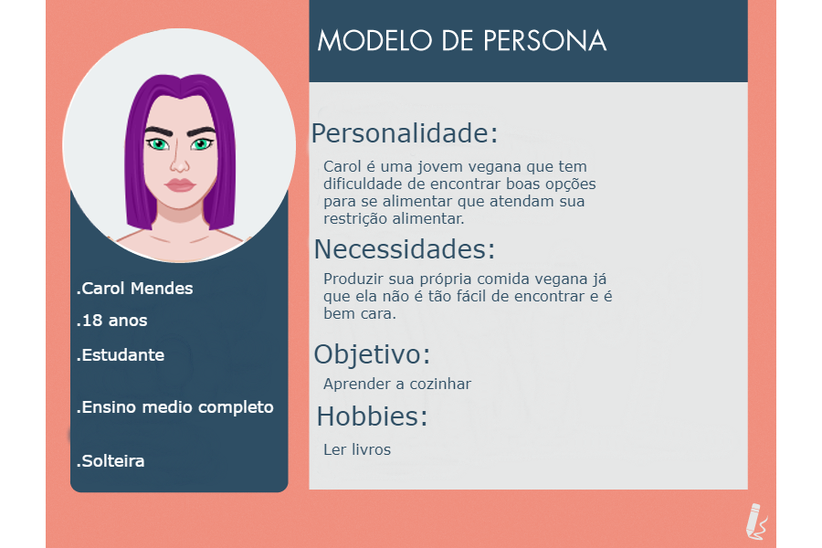
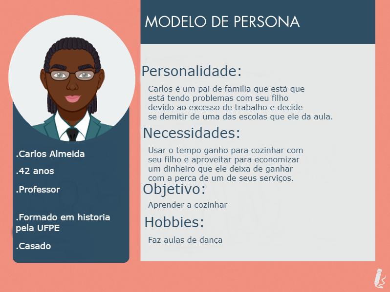
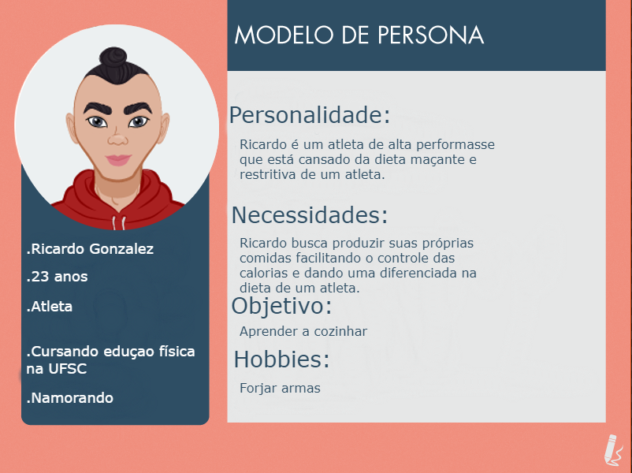
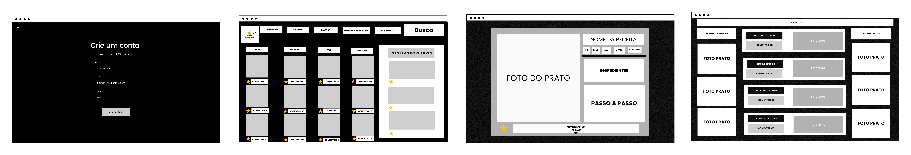
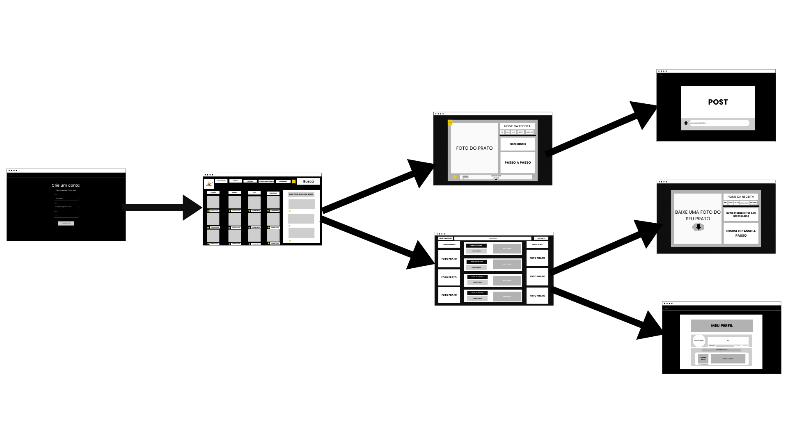
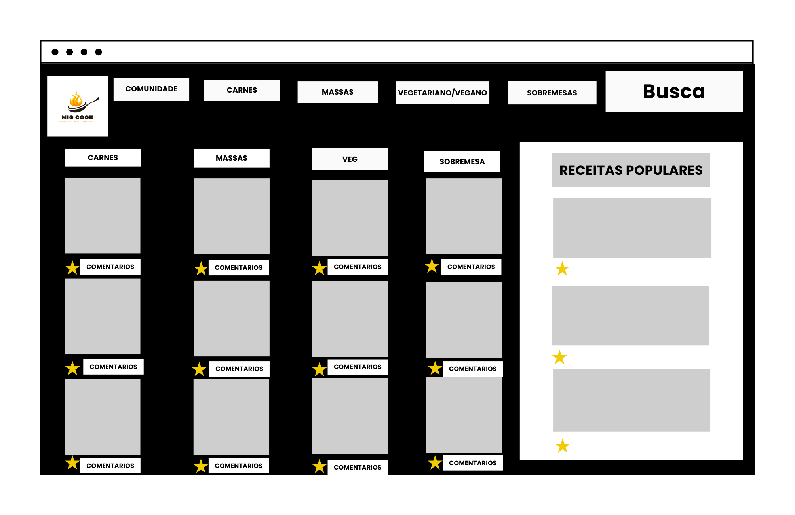

# Mig Cook
`Mig cook`  

`Ciência da computação` 

## Participantes

>
> Os membros do grupo são: 
> - Breno Moreira Cortes
> - João Pedro Mendes Monteiro
> - Luis Felipe Almeida
> - Matteus Gillis Franco Amaral

# Estrutura do Documento

- [Informações do Projeto](#informações-do-projeto)
  - [Participantes](#participantes)
- [Estrutura do Documento](#estrutura-do-documento)
- [Introdução](#introdução)
  - [Problema](#problema)
  - [Objetivos](#objetivos)
  - [Justificativa](#justificativa)
  - [Público-Alvo](#público-alvo)
- [Especificações do Projeto](#especificações-do-projeto)
  - [Personas, Empatia e Proposta de Valor](#personas-empatia-e-proposta-de-valor)
  - [Histórias de Usuários](#histórias-de-usuários)
  - [Requisitos](#requisitos)
    - [Requisitos Funcionais](#requisitos-funcionais)
    - [Requisitos não Funcionais](#requisitos-não-funcionais)
  - [Restrições](#restrições)
- [Projeto de Interface](#projeto-de-interface)
  - [User Flow](#user-flow)
  - [Wireframes](#wireframes)
- [Metodologia](#metodologia)
  - [Divisão de Papéis](#divisão-de-papéis)
  - [Ferramentas](#ferramentas)
  - [Controle de Versão](#controle-de-versão)
- [**############## SPRINT 1 ACABA AQUI #############**](#-sprint-1-acaba-aqui-)
- [Projeto da Solução](#projeto-da-solução)
  - [Tecnologias Utilizadas](#tecnologias-utilizadas)
  - [Arquitetura da solução](#arquitetura-da-solução)
- [Avaliação da Aplicação](#avaliação-da-aplicação)
  - [Plano de Testes](#plano-de-testes)
  - [Ferramentas de Testes (Opcional)](#ferramentas-de-testes-opcional)
  - [Registros de Testes](#registros-de-testes)
- [Referências](#referências)

# Introdução

## Problema

 Falta de referência culinária  

 Aprender a cozinhar alimentos saudáveis é um desafio para muitas pessoas. A principal  é a falta de suporte e informações dispersas em diferentes fontes. Além disso, muitas vezes falta incentivo de uma comunidade que ofereça suporte de incentivos verbais  e de dicas práticas  de como ter uma alimentação saudável.

Para piorar a situação, pessoas que precisam de um controle nutricional mais restrito, como os fisiculturistas e outros atletas de alto desempenho , podem enfrentar desafios adicionais. Eles precisam não apenas saber cozinhar, mas também entender a composição nutricional dos alimentos e como combiná-los adequadamente para atender às suas necessidades específicas de macronutrientes.

Para superar essas barreiras, é fundamental encontrar fontes confiáveis de informação e uma comunidade de apoio que compartilhe os mesmos interesses e desafios. Isso pode incluir grupos de culinária e nutrição, fóruns online e redes sociais especializadas.

Além disso, é importante buscar a ajuda de profissionais especializados em nutrição ou culinária. Eles podem oferecer orientações específicas para as necessidades individuais de cada pessoa e ajudá-las a desenvolver habilidades culinárias e alcançar uma alimentação saudável e balanceada.

Por fim, é importante lembrar que aprender a cozinhar alimentos saudáveis é um processo contínuo e que exige paciência, prática e persistência. Com o suporte adequado e a determinação para alcançar seus objetivos, é possível superar esses desafios e desenvolver habilidades culinárias que contribuam para uma vida mais saudável e equilibrada.
> 

## Objetivos

O objetivo do trabalho é criar um site que ajuda pessoas que buscam se alimentar de maneira mais saudável .A aplicação busca  criar uma plataforma para ajudar iniciantes a cozinharem receitas saudáveis. Em paralelo,  terá ferramentas específicas para atletas de alto desempenho que precisam de um controle nutricional rigoroso, em especial fisicultutistas.Também, pretendemos criar uma aba comunidade que  irá usar mecanismo de redes sociais para incentivar os usuários a se manterem no caminho.
Uma alimentação saudável é o habito mais importante para promover a saúde humana, especialmente na era atual em que há centenas de opções não saudáveis. Há também uma dificuldade de encontrar sugestões de boas receitas para iniciantes. Desse modo, é crucial haver uma aplicação que resolva esse problema. Essa dificuldade é exacerbada para pessoas que precisam de um controle nutricional rigoroso como atletas, em especial fisiculturistas, cuja alimentação é essencial para se manterem competitivos. Um enorme problema para quem busca se alimentar de maneira melhor é manter esse hábito, visto que 90% das pessoas que perdem peso ganham ele de volta por não seguirem a dieta. Assim, criaremos uma aba comunidade que irá ter incentivos diários e um gerará senso de pertencimento, que é usado em redes sociais para manter seus usuários ativos.
> 

## Justificativa

Uma alimentação saudável é o habito mais importante para promover a saúde humana, especialmente na era atual em que há centenas de opções não saudáveis. Há também uma dificuldade de encontrar sugestões de boas receitas para iniciantes. Desse modo, é crucial haver uma aplicação que resolva esse problema. Essa dificuldade é exacerbada para pessoas que precisam de um controle nutricional rigoroso como atletas, em especial fisiculturistas, cuja alimentação é essencial para se manterem competitivos. Um enorme problema para quem busca se alimentar de maneira melhor é manter esse hábito, visto que 90% das pessoas que perdem peso ganham ele de volta por não seguirem a dieta. Assim, criaremos uma aba comunidade que irá ter incentivos diários e um gerará senso de pertencimento, que é usado em redes sociais para manter seus usuários ativos.

## Público-Alvo

Estimamos que a principal base de usuários será jovens que mudaram recentemente para casa própria, devido ao grande tamanho populacional  desse grupo. Prevemos que o nosso produto será extensivamente usado na comunidade de atlteas,especialmente no fisiculturismo, por conta da grande necessidade de controle da alimentação desse grupo. Também pensamos que uma grande quantidade do nosso público será de pessoas que buscam mudar de estilo de vida para um mais saudável .

## Personas, Empatia e Proposta de Valor

> Relacione as personas identificadas no seu projeto, os respectivos mapas de empatia e 
> mapas da proposta de valor. Lembre-se que você deve ser enumerar e descrever precisamente 
> e de forma personalizada todos os principais envolvidos com a solução almeja. 
> 
> Para tanto, baseie-se tanto nos documentos disponibilizados na disciplina
> e/ou nos seguintes links:
>
> **Links Úteis**:
> - [Persona x Público-alvo](https://flammo.com.br/blog/persona-e-publico-alvo-qual-a-diferenca/)
> - [O que é persona?](https://resultadosdigitais.com.br/blog/persona-o-que-e/)
> - [Rock Content](https://rockcontent.com/blog/personas/)
> - [Hotmart](https://blog.hotmart.com/pt-br/como-criar-persona-negocio/)
> - [Mapa de Empatia](https://resultadosdigitais.com.br/blog/mapa-da-empatia/)
> - [Como fazer um mapa de empatia - Vídeo](https://www.youtube.com/watch?v=JlKHGpVoA2Y)
> - [Canvas da Proposta de Valor](https://analistamodelosdenegocios.com.br/canvas-da-proposta-de-valor/)
> 
> 
> Fonte: [Como criar uma persona para o seu negócio](https://raissaviegas.com.br/como-criar-uma-persona/)
>
> **Exemplo de Proposta de Valor**
> 

## Histórias de Usuários

Com base na análise das personas forma identificadas as seguintes histórias de usuários:

|EU COMO... `PERSONA`| QUERO/PRECISO ... `FUNCIONALIDADE` |PARA ... `MOTIVO/VALOR`                 |
|--------------------|------------------------------------|----------------------------------------|
|Estudante  | Aprender a cozinhar           | Se tornar mais independente               |
|Estudante       | Aprender a cozinhar                  | Aproveitar melhor o seu tempo livre deixando de lado as telas e fazer algo que tenha interesse. |
|Estudante       | Aprender a cozinhar                  | Produzir sua própria comida vegana já que ela não é tão fácil de encontrar e é bem cara. |
|Professor       | Aprender a cozinhar                  | Usar o tempo para cozinhar com seu filho |
|Atleta          | Aprender a cozinhar                  |  produzir suas próprias comidas facilitando o controle das calorias |

> Apresente aqui as histórias de usuário que são relevantes para o
> projeto de sua solução. As Histórias de Usuário consistem em uma
> ferramenta poderosa para a compreensão e elicitação dos requisitos
> funcionais e não funcionais da sua aplicação. Se possível, agrupe as
> histórias de usuário por contexto, para facilitar consultas
> recorrentes à essa parte do documento.
>
> **Links Úteis**:
> - [Histórias de usuários com exemplos e template](https://www.atlassian.com/br/agile/project-management/user-stories)
> - [Como escrever boas histórias de usuário (User Stories)](https://medium.com/vertice/como-escrever-boas-users-stories-hist%C3%B3rias-de-usu%C3%A1rios-b29c75043fac)

## Requisitos

As tabelas que se seguem apresentam os requisitos funcionais e não funcionais que detalham o escopo do projeto.

### Requisitos Funcionais

|ID    | Descrição do Requisito  | Prioridade |
|------|-----------------------------------------|----|
|RF-001| Receitas | ALTA | 
|RF-002| Menu de navegação   | ALTA |
|RF-003| Criação de perfil de usuário   | ALTA |
|RF-004| Aba de comunidade   | ALTA |
|RF-005| Comentários   | MÉDIA |
|RF-006| Avaliação de receitas   | MÉDIA |
|RF-007| Filtro na barra de pesquisa   | MÉDIA |
|RF-008| Painel com as receitas mais populares   | MÉDIA |
|RF-009| Aba de favoritos   | BAIXA |
|RF-010| Informações da receita como: Gasto, tempo, valor nutricional, dificuldade e rendimento   | BAIXA |

### Requisitos não Funcionais

|ID     | Descrição do Requisito  |Prioridade |
|-------|-------------------------|----|
|RNF-001| Responsividade para dispositivos móveis | ALTA | 
|RNF-002| Usuabilidade | MÉDIA |
|RNF-003| Confiabilidade | MÉDIA |
|RNF-004| Desempenho, processar requisições do usuário em no máximo 3s | BAIXO |

> Com base nas Histórias de Usuário, enumere os requisitos da sua
> solução. Classifique esses requisitos em dois grupos:
>
> - [Requisitos Funcionais (RF)](https://pt.wikipedia.org/wiki/Requisito_funcional):
>   correspondem a uma funcionalidade que deve estar presente na
>   plataforma (ex: cadastro de usuário).
>
> - [Requisitos Não Funcionais (RNF)](https://pt.wikipedia.org/wiki/Requisito_n%C3%A3o_funcional):
>   correspondem a uma característica técnica, seja de usabilidade,
>   desempenho, confiabilidade, segurança ou outro (ex: suporte a
>   dispositivos iOS e Android).
>
> Lembre-se que cada requisito deve corresponder à uma e somente uma
> característica alvo da sua solução. Além disso, certifique-se de que
> todos os aspectos capturados nas Histórias de Usuário foram cobertos.
> 
> **Links Úteis**:
> 
> - [O que são Requisitos Funcionais e Requisitos Não Funcionais?](https://codificar.com.br/requisitos-funcionais-nao-funcionais/)
> - [O que são requisitos funcionais e requisitos não funcionais?](https://analisederequisitos.com.br/requisitos-funcionais-e-requisitos-nao-funcionais-o-que-sao/)

## Restrições

O projeto está restrito pelos itens apresentados na tabela a seguir.

|ID| Restrição                                             |
|--|-------------------------------------------------------|
|01| O projeto deverá ser entregue até o final do semestre |
|02| Não pode ser desenvolvido um módulo de backend        |
|03| Dificuldade de trabalhar em grupo        |

> Enumere as restrições à sua solução. Lembre-se de que as restrições
> geralmente limitam a solução candidata.
> 
> **Links Úteis**:
> - [O que são Requisitos Funcionais e Requisitos Não Funcionais?](https://codificar.com.br/requisitos-funcionais-nao-funcionais/)
> - [O que são requisitos funcionais e requisitos não funcionais?](https://analisederequisitos.com.br/requisitos-funcionais-e-requisitos-nao-funcionais-o-que-sao/)

# Projeto de Interface

>

> Apresente as principais interfaces da solução. Discuta como 
> foram elaboradas de forma a atender os requisitos funcionais, não
> funcionais e histórias de usuário abordados nas [Especificações do
> Projeto](#especificações-do-projeto).

## User Flow

> Fluxo de usuário (User Flow) é uma técnica que permite ao desenvolvedor
> mapear todo fluxo de telas do site ou app. Essa técnica funciona
> para alinhar os caminhos e as possíveis ações que o usuário pode
> fazer junto com os membros de sua equipe.
>
> **Links Úteis**:
> - [User Flow: O Quê É e Como Fazer?](https://medium.com/7bits/fluxo-de-usu%C3%A1rio-user-flow-o-que-%C3%A9-como-fazer-79d965872534)
> - [User Flow vs Site Maps](http://designr.com.br/sitemap-e-user-flow-quais-as-diferencas-e-quando-usar-cada-um/)
> - [Top 25 User Flow Tools & Templates for Smooth](https://www.mockplus.com/blog/post/user-flow-tools)
>

## Wireframes

>

> Wireframes são protótipos das telas da aplicação usados em design de interface para sugerir a
> estrutura de um site web e seu relacionamentos entre suas
> páginas. Um wireframe web é uma ilustração semelhante ao
> layout de elementos fundamentais na interface.
> 
> **Links Úteis**:
> - [Ferramentas de Wireframes](https://rockcontent.com/blog/wireframes/)
> - [Figma](https://www.figma.com/)
> - [Adobe XD](https://www.adobe.com/br/products/xd.html#scroll)
> - [MarvelApp](https://marvelapp.com/developers/documentation/tutorials/)
> 

# Metodologia

Nosso grupo realizou o trabalho em conjunto no Discord. Nós fizemos o Design Thinking em conjunto em uma plataforma online em que todos poderiam editar o documento (Google Docs) e depois cada um um foi designado com tarefas específicas da sprint. No final, um membro foi responsável por juntar todas as partes e montar o template no GitHub.

> Nesta parte do documento, você deve apresentar a metodologia 
> adotada pelo grupo, descrevendo o processo de trabalho baseado nas metodologias ágeis, 
> a divisão de papéis e tarefas, as ferramentas empregadas e como foi realizada a
> gestão de configuração do projeto via GitHub.
>
> Coloque detalhes sobre o processo de Design Thinking e a implementação do Framework Scrum seguido
> pelo grupo. O grupo poderá fazer uso de ferramentas on-line para acompanhar
> o andamento do projeto, a execução das tarefas e o status de desenvolvimento
> da solução.
> 
> **Links Úteis**:
> - [Tutorial Trello](https://trello.com/b/8AygzjUA/tutorial-trello)
> - [Gestão ágil de projetos com o Trello](https://www.youtube.com/watch?v=1o9BOMAKBRE)
> - [Gerência de projetos - Trello com Scrum](https://www.youtube.com/watch?v=DHLA8X_ujwo)
> - [Tutorial Slack](https://slack.com/intl/en-br/)

## Divisão de Papéis

| Membros  | Papel              |Tarefas |
|-----------|-------------------------|---------------|
|João Pedro Mendes  | Scrum Master |  Definir e garantir que o time esteja seguindo as práticas do Scrum  | 
|Matteus Gillis | Product owner | Definir a visão do produto e priorizar o Backlog da Sprint. | 
|Luis Felipe  | Desenvolvedor |  Desenvolver a sprint | 
|Breno Moreira | Desenvolvedor | Desenvolver a sprint |

> Apresente a divisão de papéis e tarefas entre os membros do grupo.

> **Links Úteis**:
> - [11 Passos Essenciais para Implantar Scrum no seu Projeto](https://mindmaster.com.br/scrum-11-passos/)
> - [Scrum em 9 minutos](https://www.youtube.com/watch?v=XfvQWnRgxG0)

## Ferramentas

| Ambiente  | Plataforma              |Link de Acesso |
|-----------|-------------------------|---------------|
|Processo de Design Thinkgin  | Google Docs |  https://docs.google.com | 
|Repositório de código | GitHub | https://github.com/XXXXXXX | 
|Criação dos Wireframes | Canva |  https://www.canva.com/ | 
|Criação das Personas | Avatar Maker | https://avatarmaker.com/ |
|Criação de Templates | Pixlr | https://pixlr.com/br/ |
|Comunicação | Discord | https://discord.com/ |

>
> Liste as ferramentas empregadas no desenvolvimento do
> projeto, justificando a escolha delas, sempre que possível.
> 
> As ferramentas empregadas no projeto são:
> 
> - Editor de código.
> - Ferramentas de comunicação
> - Ferramentas de diagramação
> - Plataforma de hospedagem
> 
> O editor de código foi escolhido porque ele possui uma integração com o
> sistema de versão. As ferramentas de comunicação utilizadas possuem
> integração semelhante e por isso foram selecionadas. Por fim, para criar
> diagramas utilizamos essa ferramenta por melhor captar as
> necessidades da nossa solução.
> 
> **Links Úteis - Hospedagem**:
> - [Getting Started with Heroku](https://devcenter.heroku.com/start)
> - [Crie seu Site com o HostGator](https://www.hostgator.com.br/como-publicar-seu-site)
> - [GoDady](https://br.godaddy.com/how-to)
> - [GitHub Pages](https://pages.github.com/)

## Controle de Versão

......  COLOQUE AQUI O SEU TEXTO ......

> Discuta como a configuração do projeto foi feita na ferramenta de
> versionamento escolhida. Exponha como a gerência de tags, merges,
> commits e branchs é realizada. Discuta como a gerência de issues foi
> realizada.
> A ferramenta de controle de versão adotada no projeto foi o
> [Git](https://git-scm.com/), sendo que o [Github](https://github.com)
> foi utilizado para hospedagem do repositório `upstream`.
> 
> O projeto segue a seguinte convenção para o nome de branchs:
> 
> - `master`: versão estável já testada do software
> - `unstable`: versão já testada do software, porém instável
> - `testing`: versão em testes do software
> - `dev`: versão de desenvolvimento do software
> 
> Quanto à gerência de issues, o projeto adota a seguinte convenção para
> etiquetas:
> 
> - `bugfix`: uma funcionalidade encontra-se com problemas
> - `enhancement`: uma funcionalidade precisa ser melhorada
> - `feature`: uma nova funcionalidade precisa ser introduzida
>
> **Links Úteis**:
> - [Tutorial GitHub](https://guides.github.com/activities/hello-world/)
> - [Git e Github](https://www.youtube.com/playlist?list=PLHz_AreHm4dm7ZULPAmadvNhH6vk9oNZA)
> - [5 Git Workflows & Branching Strategy to deliver better code](https://zepel.io/blog/5-git-workflows-to-improve-development/)
>
> **Exemplo - GitHub Feature Branch Workflow**:
>
> 

# **############## SPRINT 1 ACABA AQUI #############**

# Projeto da Solução

......  COLOQUE AQUI O SEU TEXTO ......

## Tecnologias Utilizadas

......  COLOQUE AQUI O SEU TEXTO ......

> Descreva aqui qual(is) tecnologias você vai usar para resolver o seu
> problema, ou seja, implementar a sua solução. Liste todas as
> tecnologias envolvidas, linguagens a serem utilizadas, serviços web,
> frameworks, bibliotecas, IDEs de desenvolvimento, e ferramentas.
> Apresente também uma figura explicando como as tecnologias estão
> relacionadas ou como uma interação do usuário com o sistema vai ser
> conduzida, por onde ela passa até retornar uma resposta ao usuário.
> 
> Inclua os diagramas de User Flow, esboços criados pelo grupo
> (stoyboards), além dos protótipos de telas (wireframes). Descreva cada
> item textualmente comentando e complementando o que está apresentado
> nas imagens.

## Arquitetura da solução

......  COLOQUE AQUI O SEU TEXTO E O DIAGRAMA DE ARQUITETURA .......

> Inclua um diagrama da solução e descreva os módulos e as tecnologias
> que fazem parte da solução. Discorra sobre o diagrama.
> 
> **Exemplo do diagrama de Arquitetura**:
> 
> 

# Avaliação da Aplicação

......  COLOQUE AQUI O SEU TEXTO ......

> Apresente os cenários de testes utilizados na realização dos testes da
> sua aplicação. Escolha cenários de testes que demonstrem os requisitos
> sendo satisfeitos.

## Plano de Testes

......  COLOQUE AQUI O SEU TEXTO ......

> Enumere quais cenários de testes foram selecionados para teste. Neste
> tópico o grupo deve detalhar quais funcionalidades avaliadas, o grupo
> de usuários que foi escolhido para participar do teste e as
> ferramentas utilizadas.
> 
> **Links Úteis**:
> - [IBM - Criação e Geração de Planos de Teste](https://www.ibm.com/developerworks/br/local/rational/criacao_geracao_planos_testes_software/index.html)
> - [Práticas e Técnicas de Testes Ágeis](http://assiste.serpro.gov.br/serproagil/Apresenta/slides.pdf)
> -  [Teste de Software: Conceitos e tipos de testes](https://blog.onedaytesting.com.br/teste-de-software/)

## Ferramentas de Testes (Opcional)

......  COLOQUE AQUI O SEU TEXTO ......

> Comente sobre as ferramentas de testes utilizadas.
> 
> **Links Úteis**:
> - [Ferramentas de Test para Java Script](https://geekflare.com/javascript-unit-testing/)
> - [UX Tools](https://uxdesign.cc/ux-user-research-and-user-testing-tools-2d339d379dc7)

## Registros de Testes

......  COLOQUE AQUI O SEU TEXTO ......

> Discorra sobre os resultados do teste. Ressaltando pontos fortes e
> fracos identificados na solução. Comente como o grupo pretende atacar
> esses pontos nas próximas iterações. Apresente as falhas detectadas e
> as melhorias geradas a partir dos resultados obtidos nos testes.

# Referências

......  COLOQUE AQUI O SEU TEXTO ......

> Inclua todas as referências (livros, artigos, sites, etc) utilizados
> no desenvolvimento do trabalho.
> 
> **Links Úteis**:
> - [Formato ABNT](https://www.normastecnicas.com/abnt/trabalhos-academicos/referencias/)
> - [Referências Bibliográficas da ABNT](https://comunidade.rockcontent.com/referencia-bibliografica-abnt/)
